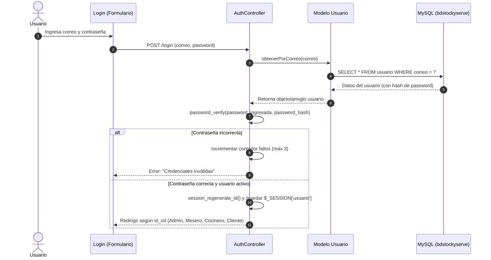

# Módulo 01: Login y Autenticación (StockYServe)

## 1. Propósito del Módulo
Controlar el acceso al sistema, verificar la identidad de los usuarios mediante credenciales seguras, proteger las contraseñas con hashing criptográfico, gestionar las sesiones activas y redirigir a cada usuario a su interfaz correspondiente según su rol (Administrador, Mesero, Cocinero, Cliente). También incluye el flujo de registro y recuperación de contraseñas.

---

## 2. Archivos Involucrados

### En PHP (Versión MVC Tradicional):
- **Vista Login / Entrada:** `public/index.php`
- **Controlador:** `controllers/AuthController.php` (acciones: `login`, `logout`, `register`, `send_code`, `verify_code`, `update_password`)
- **Modelo:** `models/Usuario.php` (métodos: `obtenerPorCorreo()`, `crear()`, `guardarCodigoRecuperacion()`, `actualizarPassword()`)
- **Vistas Adicionales:** 
  - `views/usuarios/registro.php`
  - `views/usuarios/recuperar.php`
  - `views/usuarios/verificar_codigo.php`
  - `views/usuarios/cambiar_password.php`

### En React (Versión Migrada):
- **Páginas:** 
  - `frontend/src/pages/Login.jsx`
  - `frontend/src/pages/Register.jsx`
  - `frontend/src/pages/ForgotPassword.jsx`
- **Servicio API / Context:** `frontend/src/services/api.js`, `frontend/src/context/AuthContext.jsx`
- **Backend Node/Express:** `backend/src/controllers/authController.js`, `backend/src/routes/authRoutes.js`, `backend/src/middleware/authMiddleware.js`

---

## 3. Flujo Paso a Paso de la Autenticación

### Roles y Redirección:
- **Rol 1 - Administrador:** Redirige a `/views/admin/dashboard.php` o ruta `/admin`
- **Rol 2 - Mesero:** Redirige a `/views/mesero/dashboard.php` o ruta `/mesero`
- **Rol 3 - Cocinero:** Redirige a `/views/cocinero/dashboard.php` o ruta `/cocinero`
- **Rol 4 - Cliente:** Redirige a `/views/cliente/dashboard.php` o ruta `/cliente`

---

## 4. Conceptos Técnicos Clave para Sustentar

1. **`password_hash($password, PASSWORD_BCRYPT)`**:
   - **Para qué sirve:** Convierte la contraseña en texto plano en una cadena cifrada no reversible de 60 caracteres que incluye un *salt* aleatorio.
   - **Por qué se usa:** Si alguien roba la base de datos, no puede ver las contraseñas reales ni usar tablas arcoíris (*rainbow tables*).
2. **`password_verify($password_plana, $hash_guardado)`**:
   - **Para qué sirve:** Compara la contraseña que el usuario escribió en el login contra el hash almacenado en la base de datos sin necesidad de descifrar el hash.
3. **`session_regenerate_id(true)`**:
   - **Para qué sirve:** Cambia el identificador de la cookie de sesión justo después de autenticarse.
   - **Por qué se usa:** Previene ataques de fijación de sesión (*Session Fixation*).
4. **Prepared Statements (`$stmt->prepare()` y `$stmt->execute()`):**
   - **Para qué sirve:** Separa las instrucciones SQL de los datos enviados por el usuario.
   - **Por qué se usa:** Evita Inyecciones SQL (SQL Injection), ya que las comillas o caracteres especiales se tratan como texto puro y no como comandos ejecutables.

---

## 5. Trampas y Errores Típicos en Evaluaciones (¿Qué pasa si cambian esto?)

| Si el evaluador cambia... | ¿Qué error produce? | ¿Cómo explicar qué pasó y para qué sirve? |
|---|---|---|
| Cambia `password_verify()` por `==` o `$pwd == $user['contrasena']` | El login fallará siempre para contraseñas hasheadas, o permitirá contraseñas en texto plano vulnerando la seguridad. | *"Cambiaron la función de verificación segura por comparación simple. `password_verify()` es necesaria porque en la BD la clave está encriptada con Bcrypt, no en texto plano."* |
| Quita `session_start()` al inicio del archivo | La variable global `$_SESSION` no existe o queda vacía; no se guardan las credenciales ni el login. | *"`session_start()` inicializa el almacenamiento de sesiones en el servidor. Sin ella, el sistema no recuerda quién inició sesión y rechaza cualquier acceso protegido."* |
| Cambia el nombre del campo en el query (ej: `SELECT * FROM usuario WHERE email = ?` en vez de `correo = ?`) | Error PDO / SQL `Unknown column 'email' in 'where clause'`. | *"El evaluador cambió el nombre de la columna en la consulta SQL. La base de datos tiene la columna llamada `correo`, no `email`."* |
| Modifica la condición de rol (ej: `if ($user['id_rol'] == 1)` le cambia a `2`) | El Administrador ahora se redirige al panel de Mesero o no tiene permisos de admin. | *"Se modificó la lógica de control de acceso basada en roles (RBAC). Cada `id_rol` mapea a una interfaz con permisos específicos para evitar escalamiento de privilegios."* |
| Elimina `session_destroy()` en el logout | Al cerrar sesión, la sesión sigue viva en el servidor y cualquiera puede retroceder con el navegador y seguir navegando. | *"`session_destroy()` borra los datos de la sesión del servidor para cerrar el acceso de manera definitiva y segura."* |
