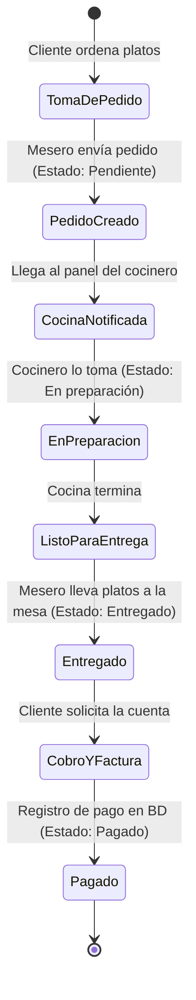

# Módulo 03: Panel del Mesero (StockYServe)

## 1. Propósito del Módulo
Permitir a los meseros (`id_rol = 2`) realizar la atención directa a los comensales en el restaurante: tomar órdenes mediante un carrito digital interactivo, asignar mesas o clientes, monitorear el progreso de los platillos en la cocina (en tiempo real), entregar los pedidos a las mesas, gestionar el cobro/cierre de la cuenta y generar la factura POS.

---

## 2. Archivos Involucrados

### En PHP:
- **Vista Principal:** `views/mesero/dashboard.php`
- **Controlador:** `controllers/PedidoController.php` (métodos: `crear()`, `cambiarEstado()`, `registrarPago()`, `obtenerActivos()`, `detalle()`)
- **Modelos:**
  - `models/Pedido.php` (consultas de inserción y transición de estados)
  - `models/Plato.php` (consulta de platos disponibles para el menú del mesero)
  - `models/Usuario.php` (búsqueda y asignación de clientes)
- **Componentes Auxiliares:** Carrito flotante en JavaScript, Modales de SweetAlert2 para confirmación y cobro.

### En React:
- **Páginas:**
  - `frontend/src/pages/MeseroDashboard.jsx` (Resumen del turno y pedidos activos)
  - `frontend/src/pages/CrearPedido.jsx` (Catálogo de platillos, carrito, selector de mesa)
  - `frontend/src/pages/PedidosActivosMesero.jsx` (Semáforo de pedidos en curso, avance de estado)
  - `frontend/src/pages/EstadoMesas.jsx` (Mapa de mesas: Libre, Ocupada, Por cobrar)
  - `frontend/src/pages/FacturaPOS.jsx` (Generación e impresión de comprobante)
  - `frontend/src/pages/HistorialMesero.jsx` (Órdenes cerradas en la jornada)

---

## 3. Flujo Completo del Mesero



### Pasos Operativos:
1. **Crear Pedido:** El mesero filtra platillos por categoría (Bebidas, Platos Fuertes, Postres, etc.), agrega ítems al carrito con su respectiva cantidad y notas especiales (ej. "sin cebolla").
2. **Asignación de Mesa / Cliente:** Selecciona el número de mesa y si el cliente está registrado en el sistema lo busca por nombre o correo; si no, se asigna como cliente general.
3. **Monitoreo en "Pedidos Activos":**
   - Ve en pantalla los pedidos organizados por tarjetas con colores distintivos.
   - Cuando la cocina despacha, el mesero presiona el botón **"Entregar a Mesa"**.
4. **Cierre y Cobro:**
   - Presiona **"Cobrar / Cuenta"**.
   - Se despliega el modal de pago: Efectivo (calcula el cambio), Tarjeta, Transferencia, Nequi o Daviplata.
   - Al confirmar el pago, se guarda en la tabla `pago` y el estado del pedido pasa a `Pagado`.
   - Se habilita la opción de imprimir el ticket / factura POS.

---

## 4. Consultas y Código Crítico

### Creación de la Transacción del Pedido (Integridad ACID):
```php
// En PedidoController / Pedido.php
$pdo->beginTransaction();
try {
    // 1. Insertar cabecera del pedido
    $stmt = $pdo->prepare("INSERT INTO pedido (fecha, estado, id_usuario, id_cliente, mesa) VALUES (NOW(), 'Pendiente', ?, ?, ?)");
    $stmt->execute([$id_mesero, $id_cliente, $mesa]);
    $id_pedido = $pdo->lastInsertId();

    // 2. Insertar cada ítem del pedido
    $stmtItem = $pdo->prepare("INSERT INTO item_pedido (id_pedido, id_plato, cantidad, precio_unitario) VALUES (?, ?, ?, ?)");
    foreach ($items as $item) {
        $stmtItem->execute([$id_pedido, $item['id_plato'], $item['cantidad'], $item['precio']]);
    }

    $pdo->commit();
} catch (Exception $e) {
    $pdo->rollBack();
    throw $e;
}
```

---

## 5. Trampas y Errores Típicos en Evaluaciones

| Si el evaluador cambia... | ¿Qué error produce? | ¿Cómo explicar qué pasó y para qué sirve? |
|---|---|---|
| Omite `beginTransaction()` y `commit()` al crear el pedido | Si falla la inserción de un plato, la cabecera del pedido queda guardada pero vacía (pedido fantasma sin ítems). | *"Las transacciones (`BEGIN`, `COMMIT`, `ROLLBACK`) garantizan Atomicidad (principio ACID). O se guarda todo el pedido con sus productos o no se guarda nada, evitando inconsistencia de datos."* |
| Cambia la condición de filtrado en `PedidosActivos`: de `WHERE estado != 'Pagado'` a `WHERE estado = 'Pendiente'` | Desaparecen del panel los pedidos que están `En preparación` o `Entregados`, por lo que el mesero no puede cobrarlos. | *"El panel de Pedidos Activos debe mostrar todas las órdenes en curso (`Pendiente`, `En preparación`, `Entregado`) y solo excluir las que ya fueron `Pagado` o `Cancelado`."* |
| Altera el cálculo del subtotal en el carrito (ej. `$total += $item['precio']` sin multiplicar por `$item['cantidad']`) | Si el cliente pide 3 cervezas, el sistema cobrará solo 1. | *"Falta multiplicar el precio unitario por la cantidad (`precio * cantidad`). Sin este producto matemático, el cobro no refleja el consumo real."* |
| Modifica el campo de la mesa (ej. envía `$mesa = null` en un campo `NOT NULL`) | Error de integridad SQL `Column 'mesa' cannot be null`. | *"La base de datos restringe la creación de pedidos sin mesa asignada para asegurar que cocina y meseros sepan a qué ubicación física llevar el servicio."* |
| Cambia el estado final a un texto no contemplado (ej: `'Cobrado'` en vez de `'Pagado'`) | La base de datos arroja error si es un `ENUM`, o los reportes de ingresos no sumarán esa venta porque buscan `estado = 'Pagado'`. | *"El sistema maneja una máquina de estados estricta (`Pendiente`, `En preparación`, `Entregado`, `Pagado`, `Cancelado`). Alterar el valor rompe la compatibilidad con el módulo de reportes y cocina."* |
