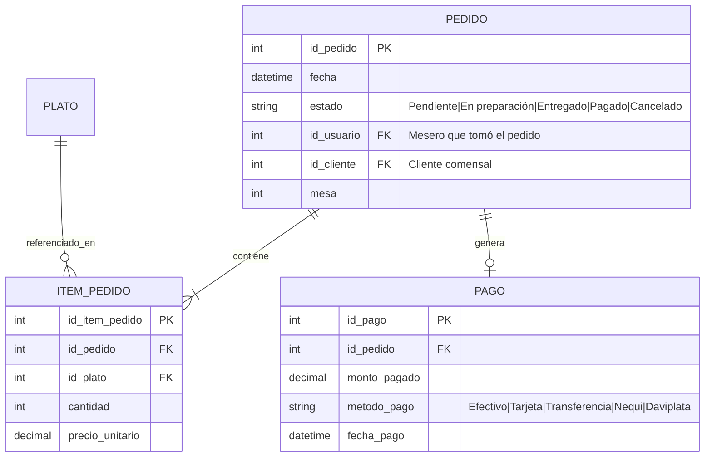

# Módulo 06: Pedidos, Facturación y Factura POS (StockYServe)

## 1. Propósito del Módulo
Administrar el núcleo operativo y financiero de StockYServe: la creación de pedidos, el registro detallado de los platillos consumidos, el cálculo matemático de subtotales y totales, el procesamiento de los métodos de pago, la liquidación en caja y la emisión del comprobante de venta o Factura POS.

---

## 2. Archivos Involucrados

### En PHP:
- **Controlador:** `controllers/PedidoController.php` (métodos: `crear()`, `cambiarEstado()`, `registrarPago()`, `generarFactura()`, `cancelar()`)
- **Modelos:**
  - `models/Pedido.php` (transacciones con MySQL, cálculos de totales y actualización de estados)
  - `models/Plato.php` (validación de precios unitarios)
- **Vistas:**
  - `views/mesero/dashboard.php` (modal de cobro y botón de cuenta)
  - `views/admin/dashboard.php` (auditoría de pedidos y pagos)

### En React:
- **Páginas:**
  - `frontend/src/pages/CrearPedido.jsx`
  - `frontend/src/pages/PedidosActivosMesero.jsx`
  - `frontend/src/pages/PedidosAdmin.jsx`
  - `frontend/src/pages/FacturaPOS.jsx` (Diseño estandarizado de recibo de caja de 80mm para impresora térmica)
- **Backend Node/Express:** `backend/src/controllers/orderController.js`, `backend/src/models/Order.js`

---

## 3. Ciclo de Vida del Pedido (Máquina de Estados)

```
 ┌─────────────┐       (Cocina inicia)       ┌────────────────┐
 │  PENDIENTE  │ ──────────────────────────► │ EN PREPARACIÓN │
 └─────────────┘                             └────────────────┘
        │                                             │
        │ (Cancelación antes de cocinar)              │ (Cocina despacha)
        ▼                                             ▼
 ┌─────────────┐                             ┌────────────────┐
 │  CANCELADO  │                             │   ENTREGADO    │
 └─────────────┘                             └────────────────┘
                                                      │
                                                      │ (Mesero cobra en caja)
                                                      ▼
                                             ┌────────────────┐
                                             │     PAGADO     │
                                             └────────────────┘
```

### Reglas de Negocio Estrictas:
1. Un pedido **no puede ser pagado dos veces**.
2. Un pedido **no puede ser cancelado si ya fue Pagado**.
3. El precio unitario guardado en `item_pedido` es una copia histórica del precio del plato al momento de la venta. Si el administrador sube los precios mañana, las facturas del pasado mantienen su valor original intacto.

---

## 4. Estructura de Tablas y Relaciones de Cobro



---

## 5. La Factura POS

El formato POS (*Point of Sale*) está optimizado para tirillas térmicas de 58mm u 80mm. Contiene:
- **Encabezado:** Nombre del establecimiento ("Centro Vacacional El Cielo"), NIT, Dirección, Teléfono.
- **Datos del Servicio:** Factura #, Fecha y hora de emisión, Número de mesa, Nombre del mesero que atendió.
- **Tabla de Consumo:** Cantidad, Descripción del plato, Valor unitario, Subtotal.
- **Totales y Pago:** Total a pagar, Método de pago, Monto entregado en efectivo y Cambio devuelto.
- **Pie de página:** Mensaje de agradecimiento y resolución DIAN / aviso legal.

---

## 6. Trampas y Errores Típicos en Evaluaciones

| Si el evaluador cambia... | ¿Qué error produce? | ¿Cómo explicar qué pasó y para qué sirve? |
|---|---|---|
| Guarda en `item_pedido` el `id_plato` pero no guarda el `precio_unitario` (o hace `JOIN plato` para ver el precio actual) | Si el restaurante cambia el precio de un plato en el futuro, se alterarán retroactivamente todas las ventas del pasado y los reportes contables no cuadrarán. | *"El `precio_unitario` debe congelarse en la tabla `item_pedido` para preservar la trazabilidad histórica de la venta (inmutabilidad financiera)."* |
| Permite registrar un pago menor al total calculado del pedido | Se registra un déficit o pérdida en caja sin advertencia. | *"El sistema debe validar que `monto_pagado >= total_pedido`, calculando `cambio = monto_pagado - total_pedido` para cuadrar la caja registradora."* |
| Quita la verificación de unicidad del pago para un pedido (`WHERE id_pedido = ?` en `pago`) | Se podrían insertar pagos duplicados para una misma mesa, inflando fraudulentamente los ingresos en reportes. | *"La relación entre un pedido y su cobro en caja es $1:1$. Permitir múltiples registros de pago sin control rompe la auditoría contable."* |
| Cambia la consulta de cálculo del total: quita `SUM(cantidad * precio_unitario)` y pone `SUM(precio_unitario)` | Si el cliente pidió 5 platos iguales, la factura solo sumará el precio de 1 solo plato. | *"El total es la sumatoria del producto de cantidad por precio unitario $\sum (q_i \cdot p_i)$. Sin multiplicar por la cantidad, se cobran los ítems como unidades simples."* |
