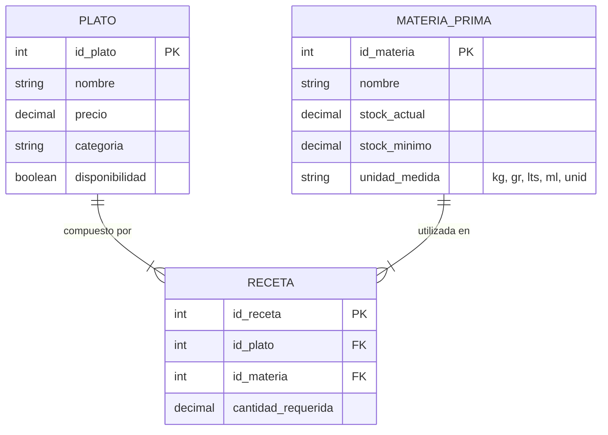

# Módulo 07: Inventario, Menú y Recetas (StockYServe)

## 1. Propósito del Módulo
Garantizar el control riguroso de las materias primas (ingredientes e insumos físicos) en bodega o cocina, vincular cada plato de la carta a una receta técnica con cantidades exactas requeridas, descontar automáticamente las existencias al vender o preparar pedidos y alertar al Administrador cuando los insumos bajen del umbral mínimo de seguridad.

---

## 2. Archivos Involucrados

### En PHP:
- **Controladores:**
  - `controllers/InventarioController.php` (acciones: entrada de stock, gestión de ingredientes, asociar recetas)
  - `controllers/PlatoController.php` (CRUD de platos, fotos y categorías)
- **Modelos:**
  - `models/MateriaPrima.php` (operaciones sobre la tabla `materia_prima`)
  - `models/Receta.php` (operaciones sobre la tabla intermedia `receta`)
  - `models/Plato.php` (operaciones sobre la tabla `plato`)
- **Vistas:**
  - `views/admin/dashboard.php` (sección Inventario con tablas y alertas visuales)

### En React:
- **Páginas:**
  - `frontend/src/pages/InventarioAdmin.jsx` (Gestión de stock, alerta de stock crítico)
  - `frontend/src/pages/MenuAdmin.jsx` (Catálogo de platillos, configuración de recetas)
- **Backend Node/Express:** `backend/src/controllers/inventoryController.js`, `backend/src/controllers/dishController.js`

---

## 3. Arquitectura del Modelo Relacional de Inventario



### Explicación de la Tabla Intermedia `receta`:
Un plato (ej. *"Hamburguesa Clásica"*) requiere múltiples ingredientes:
- 1 unidad de Pan (id_materia = 5, cantidad = 1)
- 200 gramos de Carne de Res (id_materia = 8, cantidad = 200)
- 30 gramos de Queso Cheddar (id_materia = 12, cantidad = 30)

Y a su vez, la Carne de Res se utiliza en múltiples platos (Hamburguesa, Albóndigas, Carne Asada). Por tanto, es una **relación Muchos a Muchos (N:M)** resuelta mediante la tabla puente `receta` con el atributo de cantidad requerida.

---

## 4. Algoritmo de Descuento de Inventario

Cuando se procesa una comanda de un plato:
$$\text{Nuevo Stock} = \text{stock\_actual} - (\text{cantidad\_platos\_pedidos} \times \text{cantidad\_requerida})$$

### Consulta SQL de Actualización de Stock:
```sql
UPDATE materia_prima mp
INNER JOIN receta r ON mp.id_materia = r.id_materia
SET mp.stock_actual = mp.stock_actual - (r.cantidad_requerida * ?)
WHERE r.id_plato = ?;
```

### Control de Alerta de Stock Crítico:
```sql
SELECT nombre, stock_actual, stock_minimo, unidad_medida
FROM materia_prima
WHERE stock_actual <= stock_minimo;
```
> Si una materia prima llega a `stock_actual <= stock_minimo`, el sistema resalta el registro en color rojo y envía una notificación para alertar la necesidad de compra a proveedores.

---

## 5. Trampas y Errores Típicos en Evaluaciones

| Si el evaluador cambia... | ¿Qué error produce? | ¿Cómo explicar qué pasó y para qué sirve? |
|---|---|---|
| Cambia `SET stock_actual = stock_actual - ...` por `SET stock_actual = ...` (sin restar del actual) | Sobrescribe el inventario total con la cantidad del último plato pedido, destruyendo el stock real de la bodega. | *"El operador de resta acumulativa (`stock_actual - gasto`) descuenta el insumo consumido manteniendo el remanente previo."* |
| Quita la verificación de stock negativo (ej. permitir `stock_actual < 0`) | El sistema permite seguir vendiendo platos aunque ya no queden ingredientes en físico, creando inconsistencias operativas. | *"Debe validarse que `stock_actual >= cantidad_requerida` antes de autorizar la orden, o marcar el plato con `disponibilidad = 0` para no vender humo."* |
| Elimina una materia prima que está en la tabla `receta` sin tener `ON DELETE CASCADE` o validación | Error de integridad referencial: `Cannot delete or update a parent row: a foreign key constraint fails`. | *"La clave foránea (`FOREIGN KEY`) protege la integridad de la base de datos; no se puede borrar un ingrediente si existen recetas activas que dependen de él."* |
| Cambia las unidades de medida (ej. descuenta gramos de un stock almacenado en kilogramos) | Descuenta cantidades erróneas (ej. restar 200 kg en vez de 0.2 kg). | *"Las unidades de medida deben ser homogéneas o incluir un factor de conversión para garantizar la exactitud de los balances de masa."* |
