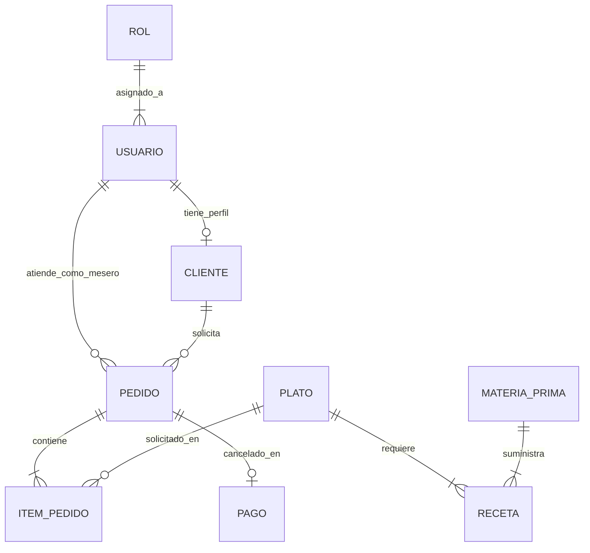

# Módulo 08: Base de Datos y Modelos (StockYServe)

## 1. Propósito del Módulo
Detallar el diseño relacional físico, las entidades, atributos, restricciones de integridad referencial, transacciones y consultas SQL fundamentales sobre el motor MySQL 8 en la base de datos `bdstockyserve`.

---

## 2. Parámetros de Conexión y Configuración

- **Base de Datos:** `bdstockyserve`
- **Motor:** `InnoDB` (imprescindible para soporte de Transacciones ACID y Claves Foráneas)
- **Codificación:** `utf8mb4_unicode_ci` (soporta caracteres especiales en español, tildes, diéresis y emojis)
- **Puerto:** `3320` (Configuración de Laragon en MySQL)
- **Host:** `127.0.0.1` o `localhost`
- **Archivo de Conexión PDO:** `config/database.php`

```php
// Ejemplo de conexión robusta en PHP con manejo de errores
class Database {
    private static $host = "127.0.0.1";
    private static $port = "3320";
    private static $db_name = "bdstockyserve";
    private static $username = "root";
    private static $password = "";
    private static $conn;

    public static function getConnection() {
        if (!self::$conn) {
            try {
                $dsn = "mysql:host=" . self::$host . ";port=" . self::$port . ";dbname=" . self::$db_name . ";charset=utf8mb4";
                self::$conn = new PDO($dsn, self::$username, self::$password, [
                    PDO::ATTR_ERRMODE => PDO::ERRMODE_EXCEPTION,
                    PDO::ATTR_DEFAULT_FETCH_MODE => PDO::FETCH_ASSOC,
                    PDO::ATTR_EMULATE_PREPARES => false
                ]);
            } catch (PDOException $e) {
                die("Error de conexión a la base de datos: " . $e->getMessage());
            }
        }
        return self::$conn;
    }
}
```

---

## 3. Diccionario de Datos Completo

| Tabla | Clave Primaria (PK) | Claves Foráneas (FK) | Descripción Funcional |
|---|---|---|---|
| `rol` | `id_rol` | Ninguna | Roles del sistema (1: Admin, 2: Mesero, 3: Cocinero, 4: Cliente). |
| `usuario` | `id_usuario` | `id_rol` $\to$ `rol(id_rol)` | Cuentas de acceso, credenciales hasheadas, tokens de recuperación y estado. |
| `cliente` | `id_cliente` | `id_usuario` $\to$ `usuario(id_usuario)` | Perfil específico de comensales vinculados a una cuenta de usuario. |
| `plato` | `id_plato` | Ninguna | Menú de comida y bebidas con precio, categoría y estado de disponibilidad. |
| `pedido` | `id_pedido` | `id_usuario` $\to$ `usuario(id_usuario)`<br>`id_cliente` $\to$ `cliente(id_cliente)` | Cabecera de órdenes con fecha, estado y mesa asignada. |
| `item_pedido` | `id_item_pedido` | `id_pedido` $\to$ `pedido(id_pedido)`<br>`id_plato` $\to$ `plato(id_plato)` | Líneas o detalles de cada platillo solicitado dentro de un pedido. |
| `pago` | `id_pago` | `id_pedido` $\to$ `pedido(id_pedido)` | Registro de transacciones financieras y liquidación en caja. |
| `materia_prima` | `id_materia` | Ninguna | Control de inventario físico de insumos, unidades y umbrales mínimos. |
| `receta` | `id_receta` | `id_plato` $\to$ `plato(id_plato)`<br>`id_materia` $\to$ `materia_prima(id_materia)` | Tabla puente que estipula la cantidad de insumos requerida por cada plato. |

---

## 4. Diagrama Entidad - Relación (DER)



---

## 5. Trampas y Errores Típicos en Evaluaciones

| Si el evaluador cambia... | ¿Qué error produce? | ¿Cómo explicar qué pasó y para qué sirve? |
|---|---|---|
| Cambia el puerto en la conexión (ej. pone 3306 en vez de 3320) | Error fatal: `PDOException: SQLSTATE[HY000] [2002] Connection refused` o `No connection could be made`. | *"Laragon tiene MySQL configurado específicamente en el puerto `3320` para evitar colisiones con otros servicios. Si se cambia el puerto, la aplicación no puede encontrar el socket de la base de datos."* |
| Cambia `ATTR_ERRMODE` a `PDO::ERRMODE_SILENT` | Los errores SQL no lanzarán excepciones ni mensajes visibles; las consultas fallarán en silencio y la página quedará en blanco. | *"El modo `PDO::ERRMODE_EXCEPTION` es indispensable en desarrollo para atrapar errores con `try/catch` y depurar anomalías rápidamente."* |
| Intenta hacer `DELETE FROM plato WHERE id_plato = 1` teniendo registros en `item_pedido` | Error: `Cannot delete or update a parent row: a foreign key constraint fails`. | *"Las restricciones de Clave Foránea (`RESTRICT` por defecto) impiden borrar un registro padre si existen registros hijos que dependen de él, protegiendo la integridad histórica del sistema."* |
| Concatenar variables directamente en la consulta (ej: `"... WHERE correo = '$correo' AND contrasena = '$pass'"`) | Vulnerabilidad crítica de **Inyección SQL** (SQLi). | *"Las consultas preparadas (`prepare()` y `execute()`) compilan la consulta de antemano y pasan los valores como parámetros aislados, neutralizando cualquier intento de inyección de código malicioso."* |
| Quitar el motor `ENGINE=InnoDB` y usar `MyISAM` | Se pierde el soporte para transacciones y claves foráneas; un `rollback()` no revertirá los cambios erróneos. | *"InnoDB es un motor transaccional que cumple con las propiedades ACID (Atomicidad, Consistencia, Aislamiento y Durabilidad). MyISAM no soporta transacciones seguras."* |
